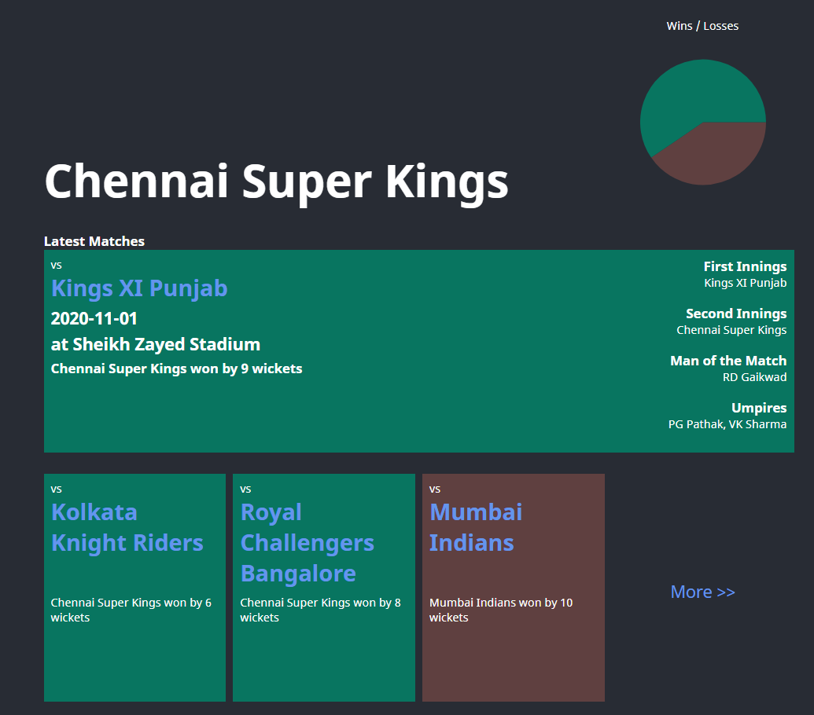
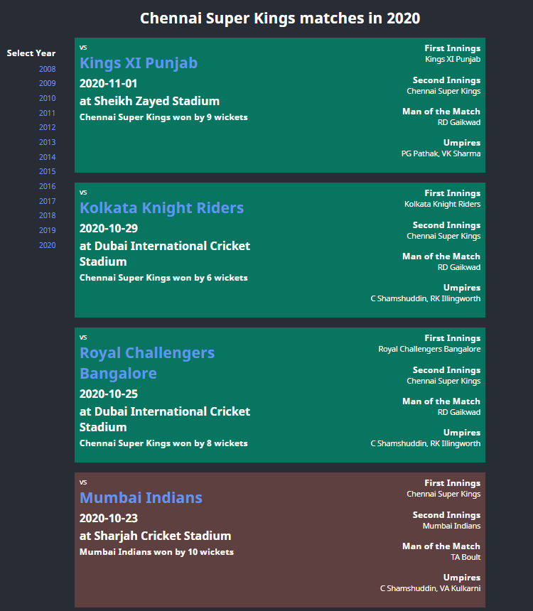

# Budget IPL Dashboard

This is a low budget IPL Dashboard to show teams and their game details in IPL (2008 - 2020).

App is built using Spring Boot and React JS. To run it locally check [application.properties](src/main/resources/application.properties) file for Java & [.env](src/frontend/.env) file for React.

## Screenshots

### Team Page

### Matches Page

